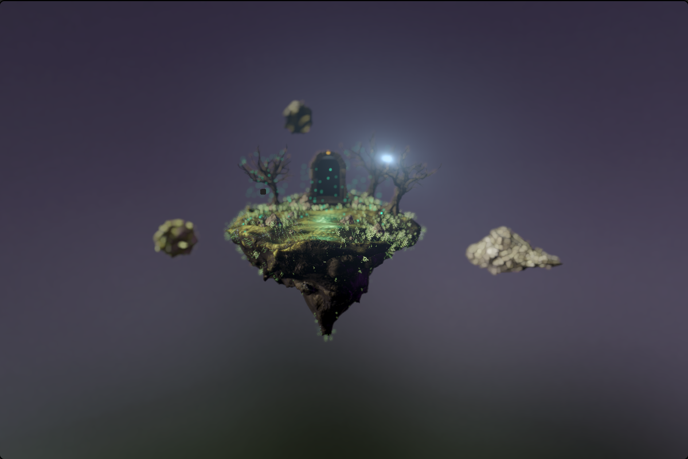

# tehno Island

A floating island with a working portal, built with React Three Fiber.



**Live demo:** https://mdev-co.github.io/tehnoIsland/

## What's inside

- **Portal:** a second scene is rendered into its own render target and drawn through a stencil mask with a custom GLSL shader (`src/components/FillQuad.jsx`, `src/components/Portal.jsx`).
- **Post-processing:** god rays, depth of field, chromatic aberration, hue/saturation and brightness/contrast.
- **Dark mode:** animated hue shift, slow camera drift, floating rocks start spinning, ambient sound.
- **Hover highlight** on the portal and the rocks.
- **Orbit controls:** hold the mouse button and drag to look around.

## Stack

React 18, Three.js, React Three Fiber, drei, postprocessing, Howler, Create React App.

## Run locally

```bash
npm install
npm start
```

`npm run build` creates a production build in `build/`. Every push to `master` deploys the build to GitHub Pages.

## Credits

The base scene (floating island and portal) comes from a React Three Fiber tutorial. I extended it with my own features and effects.
